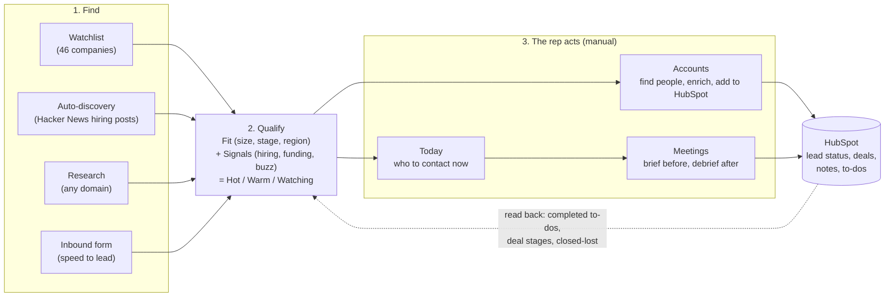

# Account Copilot

**A sales team shouldn't spend its day researching and hunting for leads. This system does that, and hands the rep a ready pipeline, so they can spend their time on conversations.**

It finds companies that match a target profile, watches public buying signals, finds the right person to contact, briefs the rep before a meeting, helps with the debrief afterwards, and keeps HubSpot in step the whole way. **Outreach stays manual: nothing is ever sent to a prospect.**

Live demo: https://copilot.f1rstword.com  ·  2-minute walkthrough: [DEMO.md](DEMO.md)  ·  One-page case study: [CASE_STUDY.md](CASE_STUDY.md)

Built for a fictional seller, "PipelineKit" (pipeline hygiene for B2B SaaS sales teams). The profile is one editable setting, so it re-points to any market in a few clicks.

## The idea in one picture



## What a rep sees

| Tab | The question it answers | What it does |
|---|---|---|
| **Today** | Who do I contact right now? | A short list led by the **person** (name, title, email), with a one-line "why today", the fresh signals and a next step. Follow-ups at day 3, 7 and 14. Waiting leads and debriefs show as banners. |
| **Accounts** | Where is every company? | One list. Each card shows **Fit**, a **Hot / Warm / Watching** label, one signal, the top contact and **one next step**: Check size, Find people, Enrich, Add to HubSpot, Mark contacted. Filters include New (auto-discovered), No contact yet, In progress and Closed-lost (Revival). |
| **Inbound** | Who just raised their hand? | A form submit is enriched, scored and routed in about 10 seconds: an email to the rep, a HubSpot to-do due in 15 minutes, and a reminder if nobody answers. Shows time to reply. |
| **Meetings** | What is booked, and how did it go? | A private brief is emailed when a meeting is booked. After it ends, a one-tap "how did it go?" email updates HubSpot and turns two lines of notes into a recap and a follow-up draft. Cancellations and moves are handled. |
| **Research** | Tell me about this company. | A dossier for any domain in about 10 seconds. |
| **Setup** | What are we looking for? | Edit industries, size, stage, regions, job titles and signals. Run discovery now. See credits and AI spend. |

## How it works

- **Signals** (free public sources): job boards (Greenhouse, Lever, Ashby), news, Hacker News. A small AI check drops namesake noise ("Linear", "Orb").
- **Fit** comes from real company data (headcount, funding stage, region) against the profile. **Hot** means it fits and something happened this week, it just raised, or it has 2+ sales roles open. A 0-100 score still exists behind the scenes for sorting and for the HubSpot fields.
- **Auto-discovery** reads the latest Hacker News "Who is hiring" threads each week, keeps companies hiring sales or RevOps roles, asks one cheap AI question ("is this a B2B software company?"), checks size and stage, and adds the ones that fit.
- **People:** one search per company, ranked by job title against the target roles. Enriching an email and pushing to HubSpot are separate, deliberate steps.
- **HubSpot, both ways:** writes lead status, a deal (only ones it created), notes and to-dos; reads back completed to-dos, deal changes and closed-lost deals, which come back as Revival when something new happens at the company.
- **Rules, not a black box:** scores, labels and lead routing are fixed rules. AI writes only a few short things (a dossier, a one-line "why now", a recap, an email draft someone edits).

## A day in the life

| When (UTC) | Job | Result |
|---|---|---|
| every minute | `meeting-brief` | Briefs for new meetings, "how did it go?" emails, cancel/move alerts, lead reminders |
| every 30 min | `crm-sync` | Reads HubSpot back |
| 01:00 | `signal-watch` | Re-reads sources for queued accounts, stores new signals, up to 3 instant hot alerts |
| 02:30 | `daily-digest` | Today list emailed, HubSpot to-dos created |
| Mondays 05:00 | `discover` | Finds new companies |
| Mondays 06:00-06:55 | `signal-scan` | Full weekly scan and scoring |
| 03:17 | `cp-logs-cleanup` | Deletes logs older than 30 days |

Everything emails the owner only.

## Stack and cost

Supabase (Postgres, Edge Functions, pg_cron), HubSpot Free, Hunter free plan, Google Calendar and Gmail (owner only), Claude Haiku 4.5, and one static page on GitHub Pages. About 4,500 lines of TypeScript and a 1,000-line page.

| Thing | Cost |
|---|---|
| Account dossier | about $0.0055 |
| Relevance check, per company scan | about $0.0004 |
| Auto-discovery, per candidate | about $0.0008 (+ 0.2 Hunter credit if it passes) |
| Inbound lead, AI part | about $0.0008 (+ 0.2 Hunter credit if the company is new) |
| Meeting recap | about $0.0017 |
| "Why today" line | about $0.0004 |

The whole project, including every build and test run, has used **about $0.20 of AI** and **14 of Hunter's 50 monthly credits**. A $0.25 daily AI cap and a monthly Hunter cap are enforced in the database.

## Security

- **Two doors, two keys.** Public visitors can read and try the demo; saving anything or seeing full names and emails needs the owner key. Scheduled jobs reject everyone except the scheduler, whose secret lives only in the database.
- **Public endpoints can't burn credits:** research and the inbound form are rate limited (per person, per hour and per day), with a $0.25 daily AI cap and a monthly Hunter cap on top. A daily cap also protects HubSpot from fake form submissions.
- **Secrets stay out of logs and URLs.** Every log line is scrubbed; raw IP addresses are never stored.
- **Database:** every table has row level security with no public policies. The one-tap debrief links are signed (HMAC) and bound to one meeting and one outcome.
- **Page:** a content security policy limits it to this project's backend; all dynamic text is escaped. Public views show names as "First L." with masked emails and no private notes.

## Run it yourself

1. Create a Supabase project, apply `supabase/migrations/` in order, load `supabase/seed.sql`.
2. Copy `.env.example` to `.env` and fill it in (HubSpot service key, Anthropic key, Hunter key, owner key, Google OAuth client).
3. `node scripts/google-auth.mjs` signs in to Google once.
4. `npx supabase secrets set --env-file .env`, then deploy each function with `npx supabase functions deploy <name> --use-api --project-ref <ref>`.
5. Serve `docs/` on any static host.

To use it for a client's own form, post JSON (`name`, `email`, `company`, `role`, `intent`, `message`, `source`) to the `inbound` function.

## Checks and debugging

```bash
bash scripts/smoke.sh        # 39 security and behaviour checks against the live project, no credits used
cd supabase/functions && deno lint . && deno check <function>/index.ts
```

Every function run writes structured rows to `cp_logs` with a `run_id` that failed requests return:

```sql
select * from cp_recent_problems limit 50;          -- what went wrong recently
select * from cp_log_summary;                       -- 24-hour health
select feature, count(*), round(sum(cost_usd)::numeric, 4) usd from cp_ai_usage group by feature;
```

`CLAUDE.md` is the engineering briefing (structure, rules, how each part works).

## Principles

Outreach is human. The system says who to contact, why now, and what to say, and keeps the CRM honest. Every number is explainable. Public visitors never see full names or emails.
